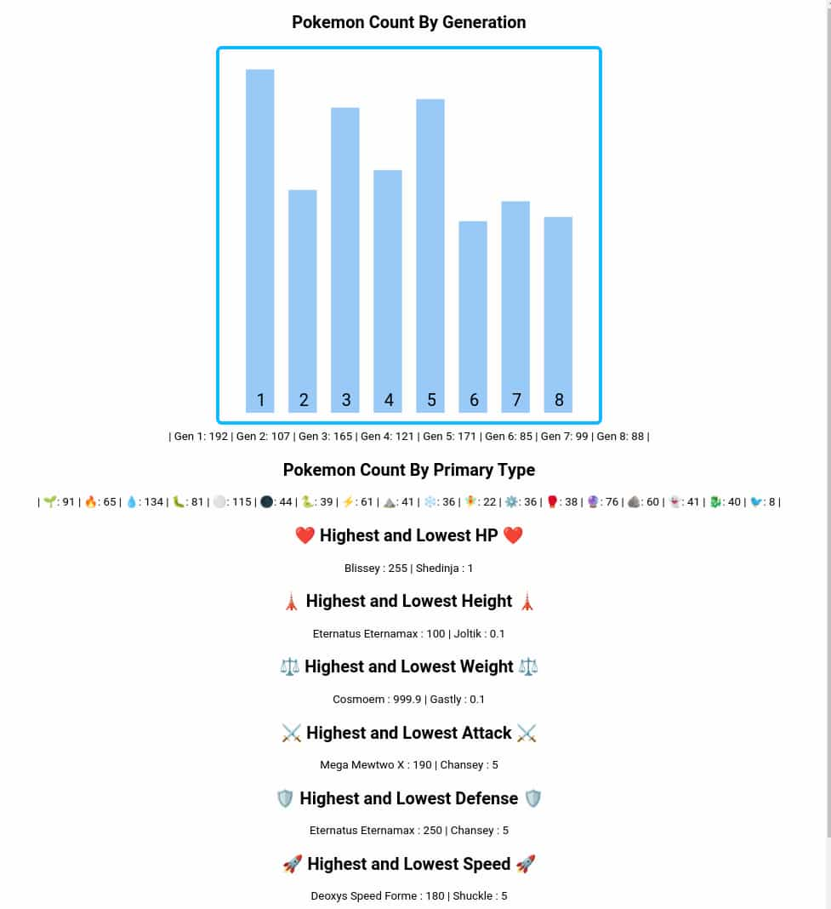

<div align = "center">

<h1><a href="https://2kabhishek.github.io/pokemon-stats">pokemon-stats</a></h1>

<a href="https://github.com/2KAbhishek/pokemon-stats/blob/main/LICENSE">
 </a>

<a href="https://github.com/2KAbhishek/pokemon-stats/pulse">
 </a>

<a href="https://github.com/2KAbhishek/pokemon-stats/stargazers">
</a>

<a href="https://github.com/2KAbhishek/pokemon-stats/network/members">
 </a>

<a href="https://github.com/2KAbhishek/pokemon-stats/watchers">
 </a>

<a href="https://github.com/2KAbhishek/pokemon-stats/graphs/contributors">
 </a>

<a href="https://github.com/2KAbhishek?tab=followers">
 </a>

<h3>Gotta stat 'em all 🖲🐭</h3>

<figure>
  
  <br/>
  <figcaption>pokemon-stats screenshot</figcaption>
</figure>

</div>

## What is this

Analyses Pokemon stats with D3 and shows them with emojis.

## Inspiration

Always wanted to know these stats about pokemon, finally got around to implementing it.

## Prerequisites

Before you begin, ensure you have met the following requirements:

- You have installed the latest version of `any web browser`, `npm`

## Getting pokemon-stats

To install pokemon-stats, follow these steps:

```bash
git clone https://github.com/2kabhishek/pokemon-stats
cd pokemon-stats
```

## Using pokemon-stats

Open [pokemon.json](./data/pokemon.json) to look at the raw stats.

To look at the compiled web version open [index.html](./index.html) or [2kabhishek.github.io/pokemon-stats](https://2kabhishek.github.io/pokemon-stats).

To make changes to the script you can edit the [main.js](./main.js) file.
You need `rollup` to compile the script.

```bash
npm install
npm run build
# or
npm run watch
```

## How it was built

pokemon-stats was built using `VS Code`, `rollup`, `d3`, and classic web tech.

## Challenges faced

Setting up `d3` with `rollup` was a minor challenge initially.

## What I learned

- Learned about rollup and it's configs
- Explored more of d3's API
- Learned about lots of Pokemon stats

Hit the ⭐ button if you found this useful.

## More Info

<div align="center">

<a href="https://github.com/2KAbhishek/pokemon-stats">Source</a> | <a href="https://2kabhishek.github.io/pokemon-stats">Website</a>

</div>
